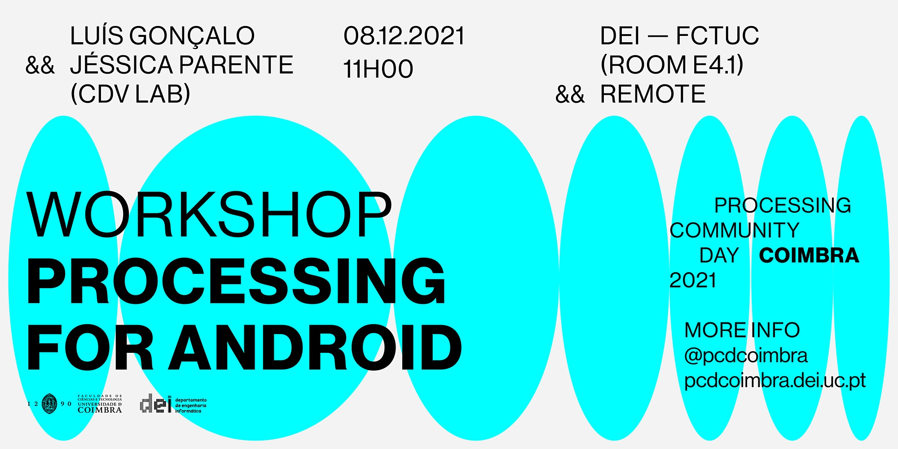

# PCD Coimbra 2021 — Workshop Processing For Android

## Requirements to the Workshop

- You must have Processing 3 installed in order to follow the workshop. Links: [MacOS](https://github.com/processing/processing/releases/download/processing-0270-3.5.4/processing-3.5.4-macosx.zip), [Linux](https://github.com/processing/processing/releases/download/processing-0270-3.5.4/processing-3.5.4-linux64.tgz), [Windows 64-bit](https://github.com/processing/processing/releases/download/processing-0270-3.5.4/processing-3.5.4-windows64.zip), [Windows 32-bit](https://github.com/processing/processing/releases/download/processing-0270-3.5.4/processing-3.5.4-windows32.zip)
- You need to have an Android smartphone and a cable to connect to the computer or optionally run on an emulator (the steps are presented below)

## Steps to install Processing for Android
**(Note: If you want to run on a emulator please skip to the part about running on an emulator)**

- Open Processing.
- In the upper right corner click on the arrow where it says Java (the default for Processing) and click on “Add Mode”.
- On the panel that appears, select Android Mode and install.
- Then, click again on the arrow in the upper right corner and select Android (this option should be visible now).
- Then, on the panel that appears, click on “Download SDK automatically”. Wait a few minutes. Alternatively, if you have the SDK already installed you can use it clicking on the “Locate it manually”. 
- Then, you have to accept the SDK license.
- Then, click OK to the confirmation that the Android mode has been installed successfully in Processing.

## Connect your Android smartphone to Processing for Android

**Note: These are the usual steps but can they can vary from smartphone to smartphone**

- In your smartphone, go to "Settings", then tap "About device" or "About phone".
- Scroll down, then tap "Build number" seven times.
- Enter your pattern, PIN or password to enable the Developer options menu.
- The "Developer options" menu will now appear in your Settings menu.
- Go to the “Developer options” and turn on “USB debugging”.
- Connect your smartphone to the computer.
- In the Processing window click on “Run on Device” to run your sketch on your smartphone.

## Optionally you can run on an emulator

- First, download and install Android Studio along with an SDK on your computer. (https://developer.android.com/studio).
- After being properly installed, open Processing.
- In the upper right corner click on the arrow where it says Java (the default for Processing) and click on “Add Mode”
- On the panel that appears, select Android Mode and install.
- Then, click again on the arrow in the upper right corner and select Android (the option should now appear).
- Then, on the panel that appears, click on “Locate it manually”. Then, an explored should apprar where you need to find a *sdk* folder where Android Studio installed the SDK.
  - In MacOS it is usually located at: `/Users/<username>/Library/Android/sdk` (It might be necessary to show hidden folders with the command CMD+SHIFT+.(DOT))
  - In Windows it is usually located at: `C:\Users\<username>\appdata\local\android\sdk`
- Finnaly, in the Processing window, go to “Sketch” on the Menu Bar, then tap “Run in Emulator”.
